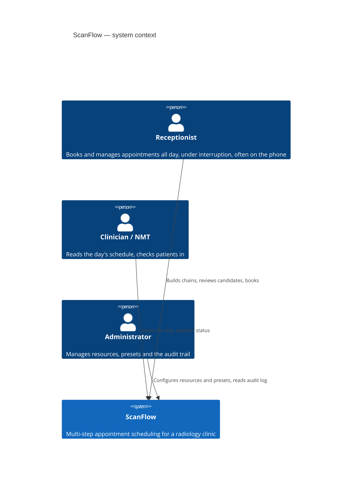
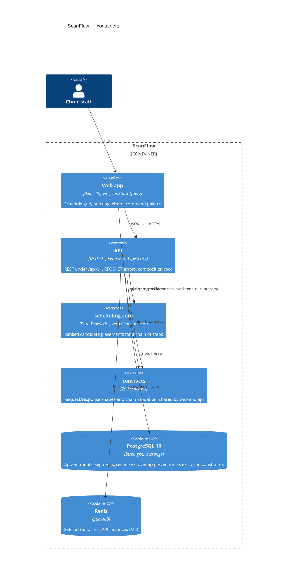

# ScanFlow architecture

## 1. The problem in one paragraph

A nuclear medicine appointment is not a booking; it is an ordered chain of
segments with temporal constraints between them, competing for capacity-1
resources. A tracer uptake study looks like consult 45m → inject 30m → wait
60–90m → scan 30m → scan 30m → consult 30m, where the wait is a clinical
requirement rather than slack, and the two consults must resolve to the same
physician. Scheduling one means placing five resource intervals and one patient
interval simultaneously such that no resource collides with anything already
booked, every mandatory delay stays inside its window, and the total span of the
visit is as short as possible.

## 2. System context (C4 level 1)



There are no external systems. Out of scope by decision: billing, PACS, HL7/FHIR
messaging, SMS reminders.

## 3. Containers (C4 level 2)



Note what `scheduling-core` is _not_ connected to. It has no edge to Postgres, to
Redis, or to Express, and it never will: it is a pure function from a chain plus a
day's availability to a ranked list of candidates.

## 4. Layering

Dependencies point inward. Nothing in an inner ring may import from an outer one.

```
        ┌──────────────────────────────────────────────┐
        │  http/       controllers, middleware, routes  │  knows Express
        ├──────────────────────────────────────────────┤
        │  modules/    use cases + ports (interfaces)   │  knows nothing about I/O
        ├──────────────────────────────────────────────┤
        │  scheduling-core + contracts                  │  pure
        └──────────────────────────────────────────────┘
             infra/    Drizzle adapters implementing the ports
             container.ts  the one place the rings are joined
```

The rules, in the order they are most often broken:

1. **`packages/scheduling-core` is pure.** No framework, no database driver, no
   I/O, no `async`, and an empty `dependencies` object. Enforced by
   `scripts/check-purity.mjs`, which also bans `Math.random` and `Date.now`
   because determinism is a tested property.
2. **Use cases never import `express`.** If a use case cannot be unit-tested
   without an HTTP mock, the boundary has leaked.
3. **Controllers parse, delegate, serialise.** No business logic, no SQL.
4. **Repositories are ports declared beside the use case that needs them.**
   Drizzle implementations live in `apps/api/src/infra/repositories`. Use cases
   depend on the interface only.
5. **All wiring happens in `apps/api/src/container.ts`.** No DI library, no
   service locator, no singletons imported across modules.
6. **Every request and response shape is a Zod schema in `packages/contracts`,**
   imported by both apps. No type is redeclared on either side.

Rules 2–4 are enforced by `import-x/no-restricted-paths` and
`no-restricted-imports` in `apps/api/eslint.config.js`, so a violation fails CI
rather than review. `container.ts` is exempt, because joining the layers is its
only job.

### The slot/time boundary

The engine speaks slot indices — a day is 36 fifteen-minute slots, indexed 0–35
from 08:00. The database speaks `timestamptz`. Exactly one module converts
between them: `apps/api/src/modules/scheduling/day-grid.mapper.ts`.

Working hours and date-specific exceptions are folded into each resource's
`busyMask` there, _before_ the engine is called, which is what lets the engine
have no concept of clock time. This is the single most likely home for off-by-one
and DST bugs, so it is isolated in one place and tested hard, once.

## 5. Concurrency model

Two receptionists can choose the same slot within the same second. Three
mechanisms handle it, in increasing order of authority.

**1. Optimistic version token.** Every read of a clinic-day returns a
`scheduleVersion` from `schedule_version`. A booking sends the version it was
looking at.

**2. Row lock plus revalidation, inside the transaction.**

```
BEGIN
  SELECT version FROM schedule_version
    WHERE clinic_id = $1 AND on_date = $2 FOR UPDATE   -- serialises this clinic-day
  if version <> client version        -> StaleScheduleError
  revalidate the chosen candidate against current segments
  INSERT appointment, appointment_step, appointment_segment
  UPDATE schedule_version SET version = version + 1
  INSERT audit_log
COMMIT
```

Locking one row per clinic-day serialises concurrent bookings for that day
without locking the segment table, so other days proceed in parallel.

**3. The database has the final word.** If anything slips past steps 1 and 2, the
two exclusion constraints reject the insert with SQLSTATE `23P01` and the whole
transaction rolls back. See ADR 0001. This is the guarantee; the two steps above
are user experience.

Either failure — `StaleScheduleError` or `23P01` — is caught at the HTTP layer,
which recomputes suggestions and returns `409 application/problem+json` carrying
`freshCandidates`. The receptionist re-enters nothing:

```json
{
  "type": "https://scanflow.local/problems/slot-conflict",
  "title": "That time was just booked",
  "status": 409,
  "detail": "Another user booked an overlapping slot. Three alternatives are available.",
  "freshCandidates": []
}
```

Mutating endpoints also accept an `Idempotency-Key`, so a retried request returns
the original response instead of creating a second appointment.

## 6. Snapshot semantics

When an appointment is booked, the chain is **copied** into `appointment_step`.
`appointment.template_id` records provenance only and is `NULL` for a chain built
from scratch.

A template edited in March must not retroactively alter an appointment booked in
February — the same rule as an invoice storing the price it was issued at rather
than pointing at the current catalog. Referencing a mutable template from a booked
appointment is a data-integrity bug that surfaces months later and is very hard to
reverse.

So: never join a booked appointment back to `template_step` to work out what it
consists of. `appointment_step` is authoritative and is what a reschedule
re-solves.

## 7. Data model shape

The tables that carry the design, rather than all of them:

- **`appointment`** — the visit header. Status, date, patient, provenance.
- **`appointment_step`** — the authoritative chain, snapshotted at booking.
- **`appointment_segment`** — the chain placed in time. One row per step plus one
  per mandatory delay. Carries `during` (patient interval) and, for `SERVICE`
  rows, `resource_during` (resource interval, containing `during`). Both
  exclusion constraints live here.
- **`appointment_template` / `template_step`** — saved presets. A read-only source
  to copy from.
- **`schedule_version`** — the optimistic concurrency token, one row per
  clinic-day.
- **`audit_log`** — one row per mutation, with `actor_id` and before/after
  snapshots. Never contains a patient identifier.

`clinic_id` is on every tenant-scoped table from day one even though a single
clinic is seeded, because adding a tenant key later means rewriting every query.

## 8. Privacy rule

No patient identifier — name, MRN, phone, date of birth — appears in any log
line, error message, or audit payload. Logs carry ids and correlation ids. This is
enforced by review and by an integration test that greps captured test logs.

## 9. Decision records

- [ADR 0001 — Postgres exclusion constraints](adr/0001-postgres-exclusion-constraints.md)
- [ADR 0002 — Zod contracts over generated OpenAPI](adr/0002-zod-contracts-over-generated-openapi.md)
- [ADR 0003 — Patient as a resource](adr/0003-patient-as-resource.md)
- [ADR 0004 — Express with explicit layering](adr/0004-express-with-explicit-layering.md)
